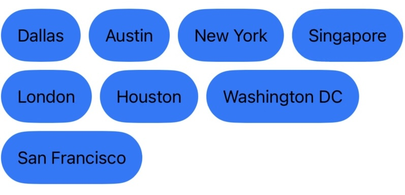

# FlowLayout



A Swift library that provides a flexible flow layout. Arrange SwiftUI subviews in a "flow" style, wrapping items to the next line when necessary — similar to how text is arranged in a paragraph.

## Features

- **Dynamic Wrapping**: Subviews automatically wrap to a new row when there’s no more room in the current row.
- **Alignment Options**: Supports different SwiftUI alignment options like leading, trailing, center, top, and bottom alignment.
- **Adjustable Spacing**: Configurable horizontal and vertical spacing between subviews.
- **Fit Content**: Optionally fit the layout’s width to the total width of the subviews, or use the parent's width as proposed by SwiftUI.

## Usage

1. Add FlowLayout as a dependency in your Swift Package Manager project:

   ```swift
   .package(
       name: "FlowLayout",
       url: "https://github.com/krishkumar/FlowLayout.git",
       .upToNextMajor(from: "1.0.0")
   )
   ```

2. Import the `FlowLayout` module in your Swift code:

   ```swift
   import FlowLayout
   ```

3. Use `FlowLayout` in your SwiftUI code:

   ```swift
    struct ContentView: View {
    	@State var allCities = ["Dallas", "Austin", "New York", "Singapore", "London", "Houston", "Washington DC", "San Francisco"]
    	var body: some View {
    		HStack {
    			FlowLayout {
    				ForEach(allCities, id: \.self) { city in
    					Text("\(city)")
    						.padding()
    						.background(Capsule().fill(.blue))
    				}
    			}
    		}
    	}
	}
    ```

## Contributing

Contributions are welcome! Feel free to open issues and submit pull requests.

## Implementation

FlowLayout uses SwiftUI’s PreferenceKeys to measure child views, making it easier to adapt dynamically to changes in content size. Combined with SwiftUI’s Layout protocol — flexibly arrange subviews that automatically reflows as needed.

## License

This project is licensed under the MIT License. See [LICENSE](LICENSE) for details.
